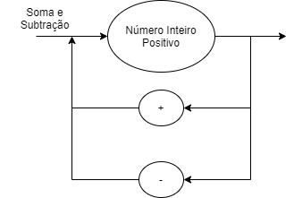

# Compilador
Compilador

# EBNF

    BLOCK = { COMMAND } ;
    COMMAND = ( λ | ASSIGNMENT | PRINT), "\n" ;
    ASSIGNMENT = IDENTIFIER, "=", EXPRESSION ;
    PRINT = "println", "(", EXPRESSION, ")" ;
    EXPRESSION = TERM, { ("+" | "-"), TERM } ;
    TERM = FACTOR, { ("*" | "/"), FACTOR } ;
    FACTOR = (("+" | "-"), FACTOR) | NUMBER | "(", EXPRESSION, ")" | IDENTIFIER ;
    IDENTIFIER = LETTER, { LETTER | DIGIT | "_" } ;
    NUMBER = DIGIT, { DIGIT } ;
    LETTER = ( a | ... | z | A | ... | Z ) ;
    DIGIT = ( 1 | 2 | 3 | 4 | 5 | 6 | 7 | 8 | 9 | 0 ) ;

# SYNTATIC DIAGRAM

# HOW TO RUN

Run the code:

    $ python main.py "file.jl"

Where file.jl is a julia file containing mathematical operations containing +, -, *, /, ( and ) operators (e.g):

    $ python main.py "test.jl"

Where test.jl is equal to:
    
    1+1*1/1+(--1)

The return should be the result of the operation (e.g):

    $ 3
