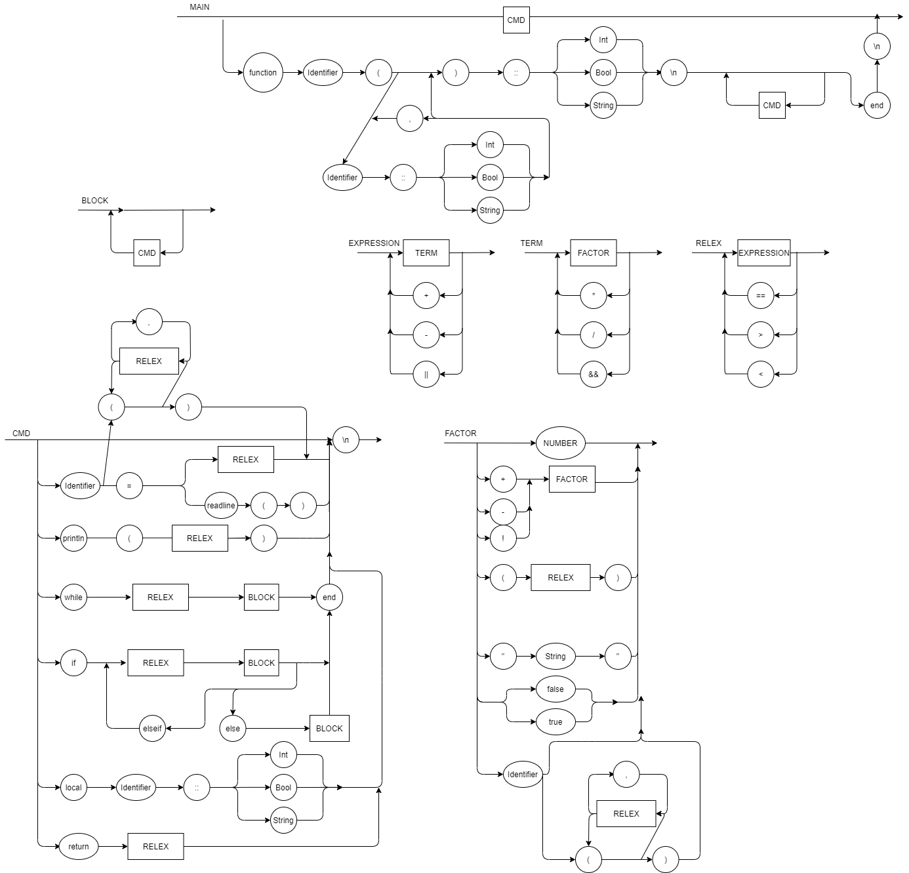

# Compilador
Compilador

# EBNF

    

# SYNTATIC DIAGRAM

# HOW TO RUN

Run the code:

    $ python main.py "operation"

Where operation is a mathematical operation containing +, -, * and / operators (e.g):

    $ python main.py "1 + 1"

The return should be the result of the operation (e.g):

    $ 2

Alternatively it is also possible to use a text file to represent the input. To do that,
write the operation on the text file and then run the following code:

    $ python main.py < example.txt
